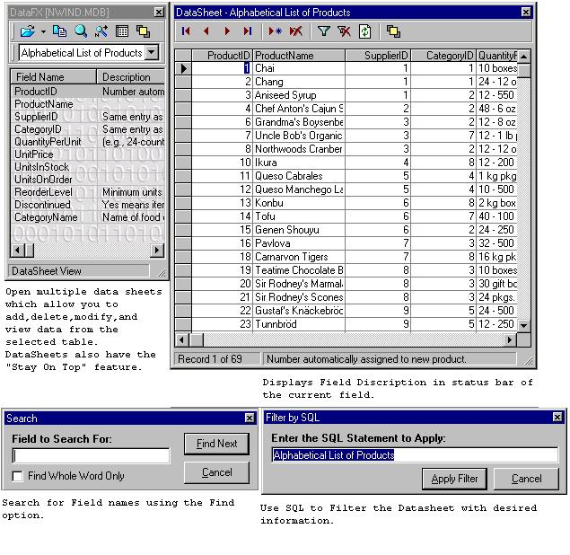



## DataFX \(Updated 3/21/02\) New Feature\!\!

### Description

Ever be in the middle of coding and forget the field names in your database? Well this little tool is for you. Open an Access Database and it will display all of your fields as well as the description and ALL of the properties for each field. You can Drag field names right from the list into your code. Never have to memorize (or type) those long field names again. Click the stay in front button and the application will stay on top, click it again and it will fall behind other windows when it loses focus. You can also search for a field name. If enough people like this I will convert it from DAO to ADO. Please leave comments. :)

Sorry for the missing .bas file. Its there now. *** 3/20/02 - Added recent file list *** 3/21/02 - Added datasheet option which allows you to open the selected table and add, delete, modify, and view data from the selected table. You can use SQL to filter the datasheet and it also has the "Stay on Top" feature. You can open as many DataSheets as you want. ADO Version coming soon!
 
### More Info
 

             |
---                |---
**Submitted On**   |2002-03-21 21:37:20
**By**             |[Chris George](https://github.com/Planet-Source-Code/PSCIndex/blob/master/ByAuthor/chris-george.md)
**Level**          |Intermediate
**User Rating**    |5.0 (60 globes from 12 users)
**Compatibility**  |VB 5\.0, VB 6\.0
**Category**       |[Databases/ Data Access/ DAO/ ADO](https://github.com/Planet-Source-Code/PSCIndex/blob/master/ByCategory/databases-data-access-dao-ado__1-6.md)
**World**          |[Visual Basic](https://github.com/Planet-Source-Code/PSCIndex/blob/master/ByWorld/visual-basic.md)
**Archive File**   |[DataFX\_\(Up643383212002\.zip](https://github.com/Planet-Source-Code/chris-george-datafx-updated-3-21-02-new-feature__1-32842/archive/master.zip)

